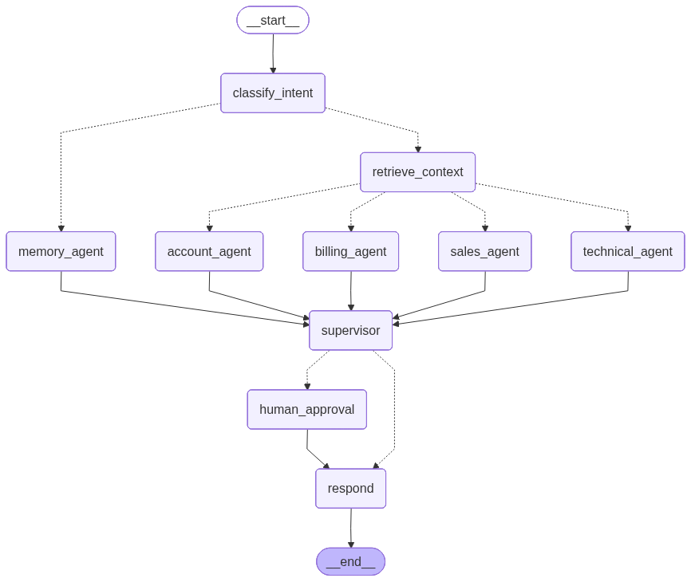

# AI-Powered Customer Support Automation System

An advanced, multi-agent customer support automation system built for **ABC Technologies** (a cloud-based business management SaaS provider). This system leverages **LangGraph** for workflow orchestration, a local **Llama 3.2 (via Ollama)** for text processing, and **SQLite** for conversation memory checkpointing and interaction logging.

---

## 🚀 Key Features

- **Intent Classification**: Dynamically routes customer queries to specialized departments (Sales, Technical, Billing, Account, or Memory).
- **Department-Specific RAG Retrieval**: Retrieves context-specific knowledge from local company documents (`documents/`) using a custom BM25 retriever. To ensure high-quality generation, retrieval queries are filtered by target document source based on the active department (e.g., Sales queries only search the `Pricing Guide`) and fetch the top 4 chunks.
- **Specialized Agent Nodes**: Independent agent logic for Sales, Technical Support, Billing, and Account Management.
- **Strict Data Extraction**: The Sales agent extracts exact pricing information ($29/month for Basic, $79/month for Professional, custom starts at $199/month for Enterprise) and accepted payment methods, entirely avoiding placeholder text.
- **SQLite Persistent Memory**:
  - LangGraph `SqliteSaver` checkpointer for session state preservation.
  - Custom SQL-backed database (`customer_interactions` table) for explicit interaction tracking and recall.
- **AI Supervisor Agent**: Reviews and polishes responses to ensure they are professional, accurate, and properly handle escalation flags.
- **Human-in-the-Loop Workflow**: Automatically interrupts high-risk requests (refunds, cancellation, account closure, compensation, and supervisor escalations) for supervisor review, choice, and optional modification.
- **Standard Query Bypass**: Standard queries (like password reset, technical troubleshooting, and sales questions) bypass human supervisor approval and conclude with a clear statement: `"Note: No human approval is required for this request."`

---

## 📁 Project Directory Structure

```text
e:/AI-Powered Customer Support Automation System/
├── documents/                       # Knowledge base for RAG pipeline
│   ├── company_policy.txt           # Refund, cancellation, and escalation policies
│   ├── faq_document.txt             # Account management and general FAQs
│   ├── pricing_guide.txt            # Software plans, storage, and billing schedules
│   └── technical_manual.txt         # Crash resolution, file upload limits, browser setup
├── src/                             # Core system modules
│   ├── __init__.py
│   ├── state.py                     # SupportState definition (TypedDict)
│   ├── rag.py                       # Text chunker and custom BM25 retriever
│   ├── memory.py                    # SQLite database log and query operations
│   ├── nodes.py                     # Workflow node functions (LLM agents, human approval, respond)
│   └── workflow.py                  # LangGraph StateGraph workflow definition
├── main.py                          # Interactive console application
├── run_demo_headless.py             # Script to run all 5 demo queries automatically
├── read_db.py                       # CLI tool to check SQLite database records
├── generate_diagram.py              # Generates graph diagram (workflow.png)
├── memory.db                        # SQLite database file (contains checkpoints & logs)
├── workflow.png                     # Rendered graph architecture image
├── Screenshot .pdf                  # Compiled PDF report of execution and output
└── README.md                        # Documentation
```

---

## 🛠️ Setup and Installation

### 1. Prerequisites
- **Python**: Version 3.10 or 3.11 recommended.
- **Ollama**: Download and install from [ollama.com](https://ollama.com/).
  - Pull the model:
    ```bash
    ollama pull llama3.2
    ```
  - Ensure the Ollama service is running locally (`http://localhost:11434`).

### 2. Activate Virtual Environment
The project comes with a pre-configured Python virtual environment (`venv/`). Activate it in PowerShell:
```powershell
.\venv\Scripts\activate
```

*(If you need to install or update dependencies manually, they are:*
`pip install langgraph langgraph-checkpoint-sqlite langchain-ollama rank_bm25 reportlab pillow`*)*

---

## 🎮 How to Run

### Option A: Interactive CLI Application (Main Entry Point)
Run the main script to start the console application:
```bash
python main.py
```
This launches a CLI menu with 4 options:
1. **Run Automated Demonstration**: Sequentially executes the 5 assignment test queries and demonstrates routing, context retrieval, human-in-the-loop, and memory recall.
2. **Start Interactive Chat Session**: Chat live with the bot under a custom thread ID.
3. **View SQLite Database Log Table**: Outputs the plain-text customer interaction logs stored in `memory.db`.
4. **Exit**: Gracefully closes connections and quits.

### Option B: Automated Headless Run (Generates Logs)
To execute all 5 demonstration queries programmatically (simulating human approval for the refund query):
```bash
python run_demo_headless.py
```

### Option C: View Custom SQLite Logs
Check the plain-text logged database records:
```bash
python read_db.py
```

---

## 📊 LangGraph Workflow Architecture

The workflow is built upon the `SupportState` and routes execution based on intent and risk. Here is the architecture of the graph (stored as `workflow.png`):



### Core Node Sequence:
1. **`classify_intent`**: Determines the department (Sales, Technical, Billing, Account, Memory) and evaluates if the query contains a high-risk request.
2. **Conditional Branching (Classification)**:
   - If classified as `Memory`, routes directly to `memory_agent`.
   - For all other categories, routes to `retrieve_context`.
3. **`retrieve_context`**: Custom BM25 retriever fetches context from the matching `documents/` txt file based on department filters.
4. **Conditional Branching (Retrieval)**: Routes to the corresponding specialized agent node (`sales_agent`, `technical_agent`, `billing_agent`, or `account_agent`).
5. **`supervisor`**: Analyzes the query, RAG context, and agent draft, polishing the message. It appends the Human Supervisor escalation notice if high-risk, or appends the `"Note: No human approval is required for this request."` statement for standard queries.
6. **Conditional Branching (Risk Evaluation)**:
   - If `is_high_risk` is `True` and `approval_status` is `Pending`, routes to `human_approval` (pausing execution).
   - If not high-risk, routes straight to `respond`.
7. **`human_approval` (Human-in-the-Loop)**: Captures supervisor decision (Approve/Reject/Modify).
8. **`respond`**: Writes the transaction details to the SQLite `customer_interactions` log table and appends the final response to the LangGraph message history.

---

## 💾 SQLite Memory Management

The database file `memory.db` stores two distinct sets of data:
1. **LangGraph Checkpoints**: Built-in state logs containing thread-specific conversational histories (managed by `SqliteSaver`).
2. **Structured Logs**: Plain-text transaction logs managed by `src/memory.py` in the `customer_interactions` table:

```sql
CREATE TABLE customer_interactions (
    id INTEGER PRIMARY KEY AUTOINCREMENT,
    thread_id TEXT NOT NULL,
    customer_name TEXT,
    query TEXT NOT NULL,
    department TEXT,
    response TEXT NOT NULL,
    timestamp DATETIME DEFAULT CURRENT_TIMESTAMP
);
```

---

## 📝 Assignment Task Mapping

| Requirement / Task | Module File Path | Implementation Summary |
|---|---|---|
| **Task 1: Diagram** | `generate_diagram.py` | Generates a PNG of the workflow using `draw_mermaid_png()`. |
| **Task 2: State** | `src/state.py` | Defines `SupportState` capturing history, classification, RAG context, and approval status. |
| **Task 3: Classifier** | `src/nodes.py` (lines 28-87) | Uses Llama3.2 to route query and identifies high-risk requests. |
| **Task 4: Routing** | `src/workflow.py` (lines 14-36) | Implements conditional routing functions. |
| **Task 5: Agents** | `src/nodes.py` (lines 125-226) | Implements Sales, Technical, Billing, and Account nodes with targeted system prompts and RAG extraction. |
| **Task 6: RAG** | `src/rag.py` | Semantic document chunking and custom BM25 retriever with source filtering. |
| **Task 7: Memory** | `src/memory.py` | Handles SQLite persistent logging and history recall querying. |
| **Task 8: Human-in-the-Loop** | `src/nodes.py` / `main.py` | Halts workflow using `interrupt_before` on high-risk requests, accepts supervisor inputs, and resumes. |
| **Task 9: Supervisor** | `src/nodes.py` (lines 264-308) | Polishes agent responses and handles high-risk escalation vs. standard query bypass labeling. |
| **Task 10: Run & Export** | `generate_diagram.py` | Visual graph export and execution logging in main console / headless runner. |
